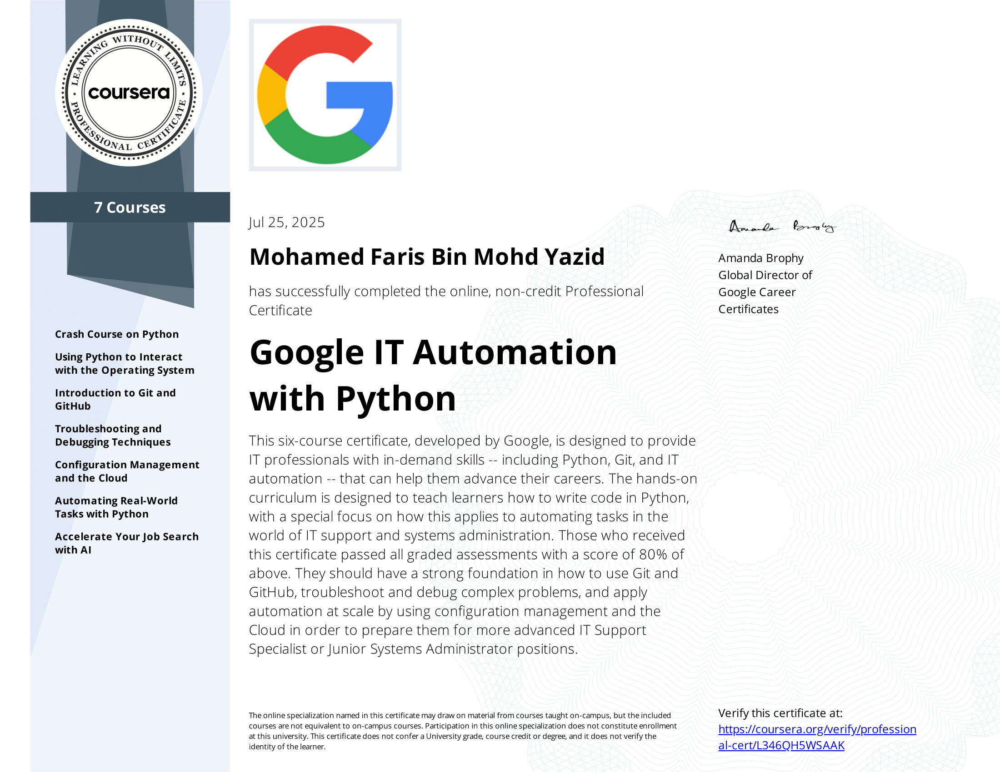
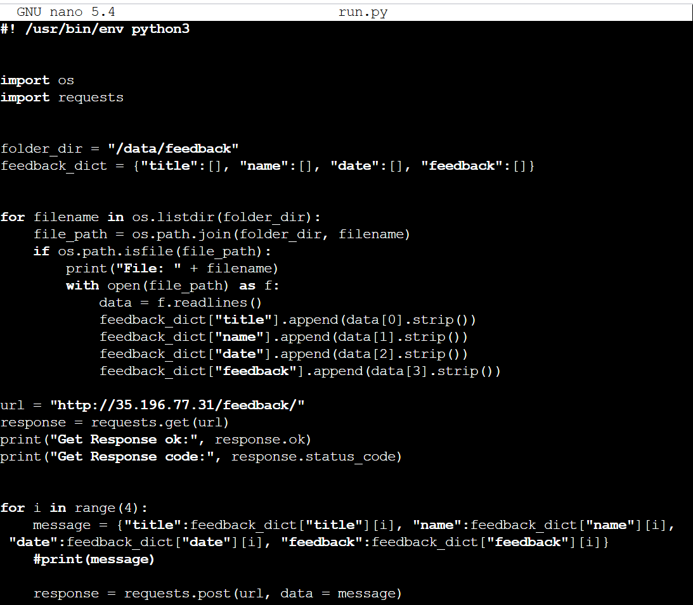
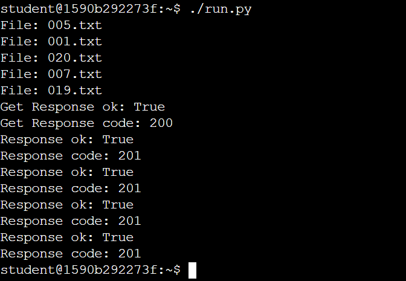
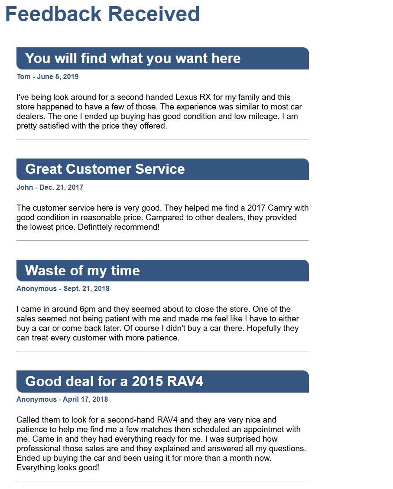

# Google-IT-Automation-with-Python
This course teaches you the basic of automation using Python based on Linux OS. Allows you to get familiar working with Bash and Python. I would highly recommend this course to anyone trying to improve their IT skills. This course provides virtual labs where you are able to practice whatever that has been taught. The final topic consists of 4 different scenarios where you have to program and automate a task on your own. 

# Topics Covered
- Crash Course on Python
- Using Python to Interact with the OS
- Introduction to Git and GitHub
- Troubleshooting and Debugging Techniques
- Configuration Management and the Cloud
- Automating Real-World Tasks with Python

# My Certificate

# Project
One of the task in the final coursework in topic 'Automating Real-World Tasks with Python' consisted of reading a json file and parsing it's content and uploading it to a HTML page
## Code

## Code output

## HTML Page

